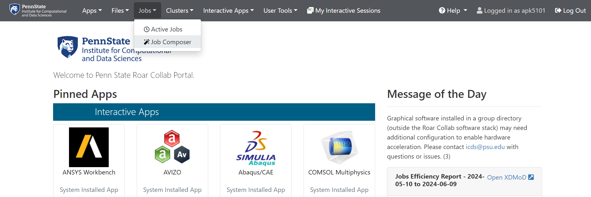
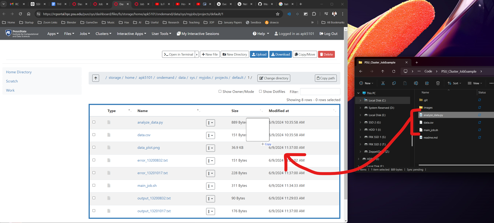
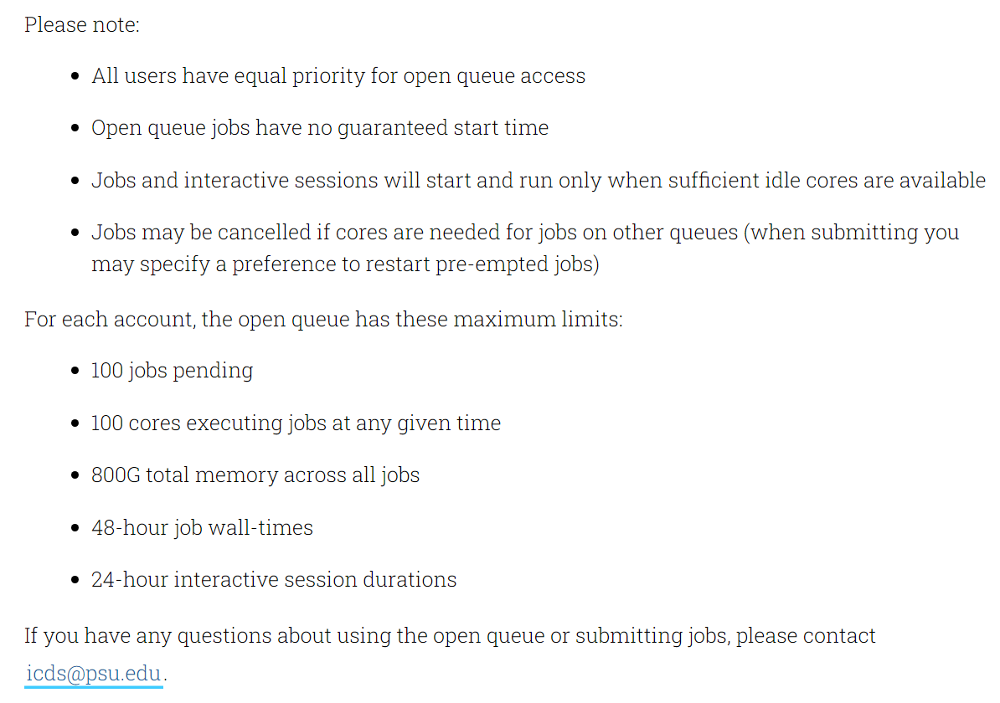

# PSU Roar Collab HPC Example Files for Job Submission

This is a brief demo of offloading scripts to the Penn State Roar Collab HPC cluster.  The example is simple but long-running and computationally expensive scripts are the target use case.  Through the portal, users can submit jobs, monitor progress, and read results.

### example results read from the portal browser interface


To try on your own with this example, three files are included here:

1. CSV file of data
2. Python script that models data from the CSV and reports the results
3. Bash script that handles cluster resource allocation, job submission, results exporting, and user notification

Each needs uploaded to the cluster through the portal to submit the job.  Step-by-step details are included below.

## Usage

0. Request an account on the Roar Collab HPC with the o[online form](https://accounts.aci.ics.psu.edu/users/) (it will request persmission from your PI)
1. Go to the  ([RCPortal page](https://rcportal.hpc.psu.edu/pun/sys/dashboard/)) and log in with your PSU credentials
2. In the taskbar, click on "Jobs" and then "Job Composer"
3. In the "Jobs" window, click "Edit Files" and upload the .csv, .py, and .sh files (can drag and drop but there is no warning of overwriting existing files, so be careful)
4. Return to the job composer and click "Submit"
5. Wait for email notification of job completion
6. Open the file manager to view or download any output and error files

### Finding The Job Composer


### Drag and Drop File Upload


## Details and Documentation

SLURM is used to manage the job scheduling and resource allocation on the cluster ([documentation here](https://slurm.schedmd.com/documentation.html))

### SLURM batch script breakdown:
  
  ```bash
  #!/bin/bash
  #SBATCH --job-name=APK_jobTest
  #SBATCH --output=output_%j.txt
  #SBATCH --error=error_%j.txt
  #SBATCH --time=01:00:00
  #SBATCH --mail-type=BEGIN,END,FAIL
  #SBATCH --mail-user=apk5101@psu.edu
  module load anaconda/2023.09
  echo "Starting job at $(date)"
  python analyze_data.py
  echo "Job finished at $(date)"
  ```

- #!/bin/bash : specifies the shell the system should use (bash here)
- #SBATCH : specifies the options for the job scheduler including number of nodes/tasks/CPUs-per-task, the time limit, and where to send the output/error
- "%j" : the job ID
- "--mail-type=BEGIN,END,FAIL" : send an email when the job starts, ends, or fails

### email notification information

- unique job id
- job name
- run time
- exit code
  - 0 : successful completion
  - 1 : generic failure
  - 2 : invalid usage (shell syntax error)

### open queue service

Free use is a part of the open queue tier of the Roar Collab Cluster found here ([ICDS Service Details](https://www.icds.psu.edu/service-details/)) which lists the following features/limits:



## To-do and Lingering Questions

- [x] find python library import methods (for now importing conda in the batch seems fine)

- [ ] surely there must be a way to avoid the CRLF line break error that arises sometimes for the .sh file (maybe a setting in the portal? or a way to convert the file to LF in the portal?).  Git automatically converts to CRLF on Windows and it seems like the portal uses CRLF by default

- [ ] if a job does not complete before the time limit, do the output and error files still get made or should the script account for this possibility by routinely updating its progress and be coded such that it can resume from where it left off?

- [ ] how does the wall time limit interact with SSH tasks?